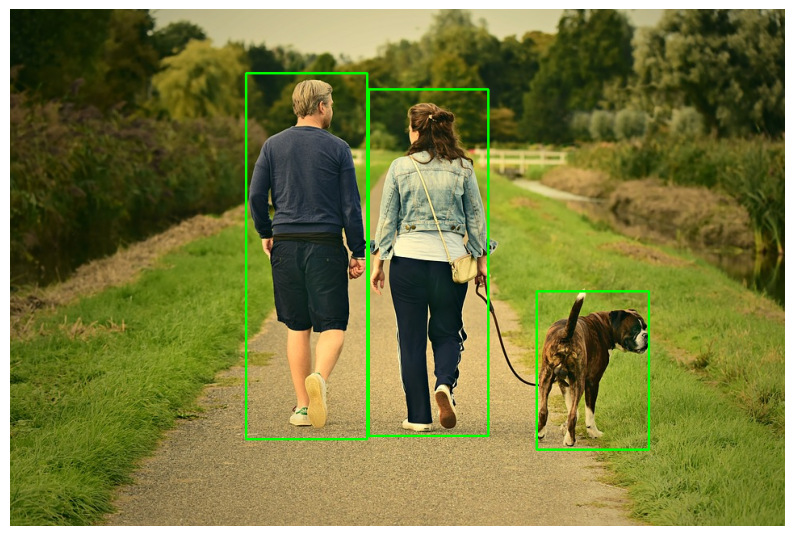
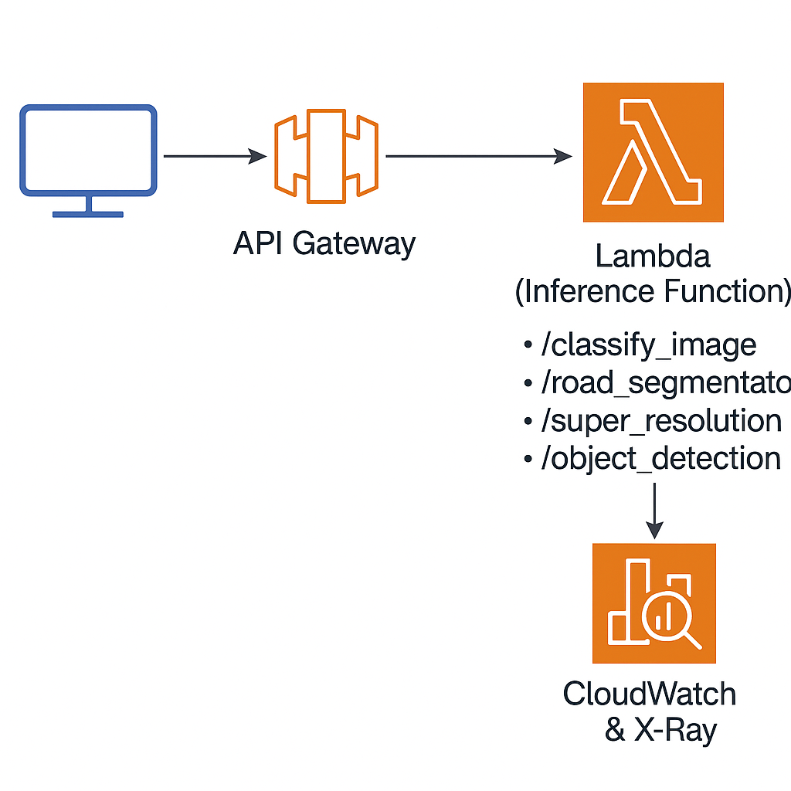

# AWS Serverless Vision Models As Service 

This project showcases the implementation of various **Computer Vision** Deep Learning models as scalable microservices using the **AWS Serverless Application Model (SAM)**. It demonstrates how to build cloud-based machine learning applications by leveraging **AWS Lambda** and **API Gateway**.

The solution includes 4 **pre-trained Deep Learning** models designed for common image processing and recognition tasks.

Each model is accessible through its own dedicated API endpoint, allowing seamless integration into any application with a single HTTP request.

## Models
Currently, Deployed Deep Learning Models:

### Image Classification


  Image Class: `'white wolf, Arctic wolf, Canis lupus tundrarum'`

Image Classification is a Deep Learning model based on Google MobileNetV3 Deep CNN model trained on **ImageNet** dataset, which contains over 1 million labeled images across 1,000 different object categories. 

**MobileNetV3-Small** was recognized as one of the most efficient image classification models for mobile CPUs at the time of its release, providing fast inference speed with low computational cost while maintaining reasonable accuracy.

**Features**

* Input: Any image (JPEG, PNG, etc.)

* Output: Predicted object class (e.g., "dog", "car", "airplane").

* Model: MobileNetV3-Small pretrained on ImageNet

* Dataset: ImageNet 1K classes (e.g., animals, vehicles, household objects, etc.)

The model `v3-small_224_1.0_float` deployed using **Intel OpenVINO** framework for optimized deep learning inference.

You can use image samples in the **/images/Image_classification** directory to test it on the model.


### Road Segmentation


Road Segmentation is a lightweight, real-time **semantic segmentation** deep learning model designed for **Advanced Driver Assistance Systems (ADAS)** and autonomous driving applications. Its primary task is to segment and identify drivable road areas in images or video frames captured from vehicle-mounted cameras.

**Key Features**
* Task: Road Area Segmentation (Pixel-wise classification)

* Input: RGB image (typically from front-facing car camera)

* Output: Pixel-wise binary class mask highlighting the road area

* Model Type: Encoder-Decoder Convolutional Neural Network (CNN)

This model `road-segmentation-adas-0001` deployed using **Intel OpenVINO** framework for optimized deep learning inference.

You can use image samples in the **/images/road_segmentation** directory to test it on the model.


### Image Super Resolution


Super Resolution is a Deep Learning model to enhance low resolution image to high quality image.

The model is based on **Single Image Super Resolution (SISR)** deep learning model which is available on Open Model Zoo, check this [page](https://docs.openvino.ai/latest/omz_models_model_single_image_super_resolution_1032.html) for more info.

**Super Resolution** is the process of enhancing the quality of an image by increasing the pixel count using deep learning.

**Specification**

* The model (Neural Network) expects inputs with a width of **480**, height of **270**.
* The model returns images with a width of **1920**, height of **1080**.
* The image sides are upsampled by a factor **4**. The new image is **16** times as large as the original image.

It has applications in a number of domains including surveillance and security, medical imagery and enhancing Satellite images from the space.

Super Resolution model `single-image-super-resolution-1032` deployed using **Intel OpenVINO** framework for optimized deep learning inference.

You can use image samples in the **/images/super_resolution** directory to test it on the model.

### Object Detection



Object Detection is a pre-trained **MobileNet** deep learning model built using the Caffe deep learning framework. This model typically refers to a MobileNet-v1 architecture, trained on the **ImageNet** (ILSVRC 2012) dataset.

**Features**

* Designed for real-time image classification and object detection on low-resource devices like smartphones, IoT devices, and embedded systems.

* Depthwise Separable Convolutions for lightweight computation

* Faster inference with minimal Memory usage

The Object detection model `mobilenet_iter_73000`  deployed using **OpenCV DNN** module for lightweight CV applications.

You can use image samples in the **/images/object_detection** directory to test it on the model.

## Project Structure
This project implements a **Computer Vision (CV) Serverless Flask API** using the AWS Serverless Application Model (SAM).
It packages multiple deep learning models and exposes their functionalities through API endpoints using AWS Lambda and API Gateway.

* **api**: Root folder for the Lambda function. Contains Flask API application code.


* **model**: Contains saved machine learning models files.

* **config.py**: Models global configuration including model paths and OpenVino runtime setting.

* **Dockerfile**: For container image-based deployment of Lambda function.

* **model.py**: Contains ML model inference logic. 

* **server.py**: Flask app defines routes/endpoints, runs inference, returns API responses.

* **template.yaml**: AWS SAM template file that Defines required AWS resources such as Lambda functions, API Gateway routes, and deployment settings.


**Flask API Typical Flow in Lambda**

* AWS API Gateway receives an HTTP request.

* API Gateway triggers the Lambda function where Flask app (server.py) is running via AWS Lambda container runtime.

* Flask app routes the request (e.g., /classify_image) → calls model.py → returns a JSON response.

## How to call it

### Image Classification Model

You can call the model by sending post request to this models API endpoint with the input image as paramater
<pre>
url = "http://127.0.0.1:3000/classify_image"
image_source = "images/Image_classification/animal_3.jpg"
# Read image and encode it in Base64 format
encoded_img = encode_image_base64(image_source)
# prepare request payload
payload = {
    'image': encoded_img
}
# send post request to url endpoint
response = requests.post(url, json=payload)
</pre>
It will return response in **json** format containing the key `img_class` for image classification.

### Road Segmentation Model

You can call the model road segmentation inference by sending post request to this models API endpoint with the input image as paramater
<pre>
url = "http://127.0.0.1:3000/road_segmentation"
image_source = "images/road_segmentation/road_1.jpg"
# read image and encode it in Base64 format
encoded_img = encode_image_base64(image_source)
# prepare request payload
payload = {
    'image': encoded_img
}
# send post request to url endpoint
response = requests.post(url, json=payload)
if response.status_code == 200:
    # decode response image result from Base64 to np array
    seg_img = decode_base64_image(response.json()['seg_image'])
</pre>
It will return response in **json** format containing the key `seg_image` for segmentation image encoded in Base64 string format.

### Super Resolution Model

You can call the model super resolution inference by sending post request to this models API endpoint with the input image as paramater
<pre>
url = "http://127.0.0.1:3000/super_resolution"
image_source = "images/super_resolution/space.jpg"
# read image and encode it in Base64 format
encoded_img = encode_image_base64(image_source)
# prepare request payload
payload = {
    'image': encoded_img
}
# send post request to url endpoint
response = requests.post(url, json=payload)
if response.status_code == 200:
    # decode response image result from Base64 to np array
    super_img = decode_base64_image(response.json()['super'])
</pre>
It will return response in **json** format containing the key `super` for super resolution image encoded in Base64 string format.


### Object Detection Model

You can call the model object detection inference by sending post request to this models API endpoint with the input image as paramater
<pre>
url = "http://127.0.0.1:3000/object_detection"
image_source = "images/object_detection/family-and-dog.jpg"
# read image and encode it in Base64 format
encoded_img = encode_image_base64(image_source)
# prepare request payload
payload = {
    'image': encoded_img
}
# send post request to url endpoint
response = requests.post(url, json=payload)
</pre>
It will return response in **json** format containing the key `detections` for list of object detections coordinates information.

You can check [this notebook](./models-API-notebook.ipynb) for live demo of calling models inference by Models API endpoints.

## AWS Architecture for SAM Serverless Application

Container-based serverless machine learning inference service, deployed as Lambda microservices behind API Gateway




### Architecture Components


| Component                          | Description                                                                                                                                                            |
| ---------------------------------- | ---------------------------------------------------------------------------------------------------------------------------------------------------------------------- |
| **AWS Lambda (InferenceFunction)** | Single Lambda function (container image based) handling multiple ML inference endpoints (image classification, road segmentation, super resolution, object detection). |
| **API Gateway**                    | Exposes multiple REST API endpoints (`/classify_image`, `/road_segmentation`, `/super_resolution`, `/object_detection`) as HTTP POST methods.                          |
| **AWS CloudWatch & X-Ray**         | Provides monitoring and distributed tracing for all Lambda calls.                                                                                                      |
| **AWS Application Insights**       | Automatically monitors the whole stack for performance and health.                                                                                                     |
| **AWS Resource Group**             | Groups all stack resources for easier management and monitoring.                                                                                                       |
| **Deployment Type**                | **Container image-based Lambda deployment** (Dockerized, packaged from the `api/` folder with a Dockerfile).                                                           |

Each ML inference task is exposed via a dedicated API endpoint:

| Endpoint             | Task                 |
| -------------------- | -------------------- |
| `/classify_image`    | Image Classification |
| `/road_segmentation` | Road Segmentation    |
| `/super_resolution`  | Super Resolution     |
| `/object_detection`  | Object Detection     |

The entire inference logic runs inside a single Lambda container, triggered by API Gateway HTTP endpoints, with monitoring, tracing, and logging fully enabled through CloudWatch, X-Ray, and Application Insights.

### Important Note for Architecture

For the purpose of this hackathon project, we implemented all Computer Vision inference endpoints (image classification, object detection, super resolution, etc.) inside a **single AWS Lambda function** deployed as a container image, with multiple API Gateway routes.

This decision was made to optimize for development speed, deployment simplicity, and reduced AWS resource configuration overhead, which is critical for the time constraints.

However, for **production-grade deployments**, we recommend adopting a multi-Lambda architecture (one function per model/endpoint), for better:

* Cold start performance
* Scaling flexibility
* Resource isolation
* Simpler CI/CD for individual models
* Lower runtime memory usage

This approach also helps meet best practices for serverless ML workloads on AWS.

## Models Deployment using AWS SAM CLI

* First you need to install [AWS SAM CLI](https://docs.aws.amazon.com/serverless-application-model/latest/developerguide/install-sam-cli.html) on your device and then verify installation 

    ```sam --version```

* Change directory to Lambda Serverless Application folder

    `cd aws-cv-serverless`

* Build AWS serverless function code locally using container. you need to have docker engine installed on your device

    `sam build --use-container`

* Call Lambda function locally on your device

    `sam local invoke`

* Start Lambda function API locally to test it 

    `sam local start-api`
    
    You can now test the serverless API endpoints 

* After the Lamda serverless application worked successfully on your device you can deploy it with the required resources on AWS using defined `template.yaml` file

    `sam deploy --guided`

    Follow the guide instructions to deploy the serverless application on AWS and make sure to create managed ECR repository for lambda image based deployment.

* You can check the logs of your Lambda function on AWS 

    `sam logs --stack-name <StackName> --name <YourFunctionName> --tail --region <YourAWSRegion>`

    Example:

    `sam logs --stack-name aws-cv-serverless --name InferenceFunction --tail --region us-east-1`

## References

[MobileNet-v3-Small: Optimized for Mobile Deployment
](https://huggingface.co/qualcomm/MobileNet-v3-Small)

[Road Segmentation for ADAS/AD Applications
](https://arxiv.org/html/2505.12206v1)

[Single Image Super Resolution Research Paper](https://arxiv.org/abs/1807.06779)

[MobileNets: Efficient Convolutional Neural Networks for Mobile Vision Applications](https://arxiv.org/abs/1704.04861)

